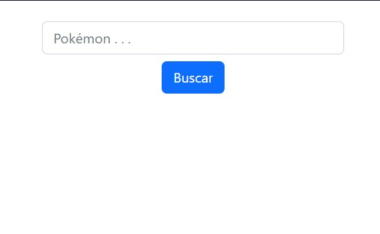

# Fetch-API-Pok-mon-en-JavaScript
primer ejemplo de Pokédex que hago con la API de Pokémon

  
    
   
  
  

## ¿Cuál es el fin de este proyecto?
El Objetivo de este proyecto es el de probar el manejo basico con el uso de una API y sus caracteristicas.

## ¿Puedo Probarlo en Linea? 
Si, Puedes probarlo en linea haciendo click [aqui](https://carlosorellana00.github.io/Fetch-API-Pok-mon-en-JavaScript/)

## ¿Cómo puedo probarlo de manera local en mi equipo?
puede copiarse directamente desde git a traves de comando o descargarse en un archivo Zip, es recomendable usar algun medio de servidor local para probarlo con 
mayor seguridad dentro de una instancia local, pero es algo opcional.

## Modo de uso

Para usar este programa debemos de ingresar a la vista,  el cual se nos presentara de la siguiente manera.

  

Posteriormente escribimos el nombre del Pokémon que queremos buscar, debemos asegurarnos que este bien escrito y le damos a Buscar, y nos aparecera una imagen del
Pokémon y su nombre, para este ejemplo e usado al clásico "pikachu" . 

  

## Herramientas Utilizadas:
- [Bootstrap](https://getbootstrap.com)
- [PokéAPI](https://pokeapi.co)

## Agradecimientos y Referencias:
- [Autor Original -> Code Hive](https://www.youtube.com/c/CodeHiveChannel)
- [Video Original -> Fetch API Javascript | Traer Datos de una API (2021)](https://www.youtube.com/watch?v=c4GXJPZjYYI&list=LL)
